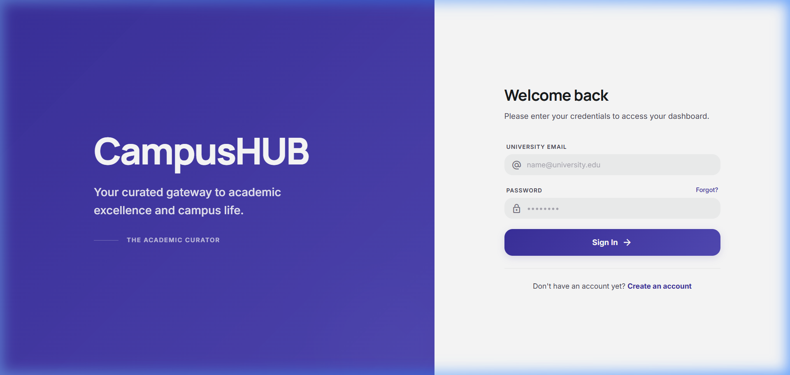
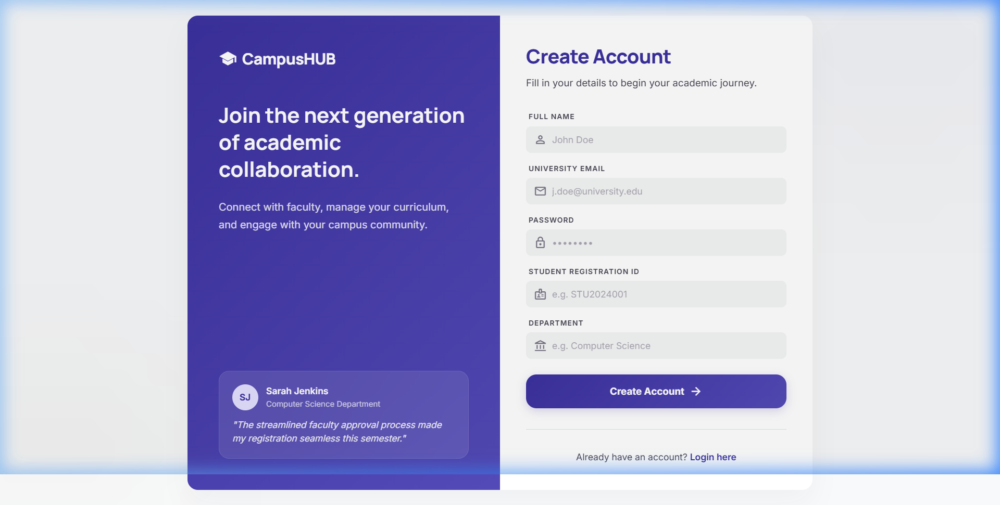

<p align="center">
  
</p>

<h1 align="center">CampusHUB</h1>

<p align="center">
  <strong>A modern campus social networking platform for students and faculty</strong>
</p>

<p align="center">
  
  
  
  
  
  
</p>

---

CampusHUB is a full-stack, real-time campus social network that connects students and faculty through a rich feed, direct messaging, event calendars, and role-based administration — all wrapped in a polished, modern UI.

## 📸 Screenshots

<p align="center">
  
  <br/><em>Login — clean split-panel design with branded hero</em>
</p>

<p align="center">
  
  <br/><em>Registration — faculty-approved onboarding with department & ID verification</em>
</p>

---

## ✨ Features

### 🔐 Authentication & Security
- **JWT-based authentication** with Bearer token strategy
- **Role-based access control** — `student` and `faculty` roles with distinct permissions
- **Faculty-approved registration** — new students start with `pending` status until approved by faculty
- **Forgot password** — OTP-based password reset via email (Nodemailer)
- **Auto-logout** on token expiry with seamless 401 interceptor
- **Security hardening** — Helmet headers, CORS origin restriction, rate limiting (200 req/15 min), NoSQL injection sanitization
- **Graceful shutdown** with proper MongoDB connection cleanup

### 📰 Social Feed
- **Rich text posts** with 500-character limit
- **Media uploads** — images (JPEG, PNG, GIF, WebP) and videos (MP4, WebM, MOV) via **Cloudinary**
- **File size enforcement** — 5 MB for images, 25 MB for videos
- **Announcements** — faculty can post announcements alongside regular posts
- **Like / unlike** toggle on posts
- **Commenting system** with per-comment 300-character limit
- **Paginated feed** with "Load More" infinite scroll
- **Post deletion** with automatic Cloudinary media cleanup

### 💬 Real-Time Messaging
- **1-on-1 direct messaging** powered by **Socket.IO**
- **Live message delivery** — new messages appear instantly without refresh
- **Typing indicators** — see when someone is composing a reply
- **Online presence** — real-time online/offline user status
- **Unread message count** badge in the navbar
- **Read receipts** tracking
- **Conversation persistence** via URL-based routing
- **User search** to start new conversations

### 👤 User Profiles
- **Customizable profile** — bio, department, profile picture (Cloudinary upload)
- **Followers / Following** system with real-time stats
- **User post feed** — view all posts by a specific user
- **Public profiles** — click any username or avatar to view their profile
- **"Message" button** on profiles to initiate direct conversations

### 📅 Event Calendar
- **Campus event listing** in the feed sidebar
- **Faculty-only event creation** — title, description, date, time, and location
- **Chronological sorting** with featured first-event styling
- **Faculty event management** — delete your own events

### 🎓 Faculty Dashboard
- **Pending registrations queue** — view all students awaiting approval
- **Approve / Reject** actions with real-time queue updates
- **Student details** — name, email, registration ID, department, and registration date
- **Protected route** — accessible only to faculty-role users

---

## 🏗️ Architecture

```
campushub/
├── client/                    # React 19 + Vite frontend
│   ├── public/                # Static assets (favicon, icons)
│   ├── src/
│   │   ├── api/               # Axios instance with interceptors
│   │   │   └── axios.js
│   │   ├── components/        # Reusable UI components
│   │   │   ├── FacultyRoute.jsx
│   │   │   ├── Layout.jsx
│   │   │   ├── Navbar.jsx
│   │   │   ├── PostCard.jsx
│   │   │   ├── PostComposer.jsx
│   │   │   └── PrivateRoute.jsx
│   │   ├── context/           # Global state providers
│   │   │   ├── AuthContext.jsx
│   │   │   └── SocketContext.jsx
│   │   ├── pages/             # Route-level page components
│   │   │   ├── Feed.jsx
│   │   │   ├── Login.jsx
│   │   │   ├── Register.jsx
│   │   │   ├── ForgotPassword.jsx
│   │   │   ├── Profile.jsx
│   │   │   ├── UserProfile.jsx
│   │   │   ├── Messages.jsx
│   │   │   └── FacultyDashboard.jsx
│   │   ├── App.jsx            # Router configuration
│   │   ├── main.jsx           # Entry point
│   │   └── index.css          # Global styles & design system
│   ├── index.html
│   ├── vite.config.js
│   └── package.json
│
├── server/                    # Express 5 + MongoDB backend
│   ├── config/
│   │   └── cloudinaryConfig.js
│   ├── controllers/
│   │   ├── authController.js
│   │   ├── postController.js
│   │   ├── userController.js
│   │   ├── messageController.js
│   │   ├── eventController.js
│   │   └── facultyController.js
│   ├── middleware/
│   │   └── authMiddleware.js  # JWT protect + facultyOnly guard
│   ├── models/
│   │   ├── User.js
│   │   ├── Post.js
│   │   ├── Comment.js
│   │   ├── Conversation.js
│   │   ├── Message.js
│   │   └── Event.js
│   ├── routes/
│   │   ├── auth.js
│   │   ├── posts.js
│   │   ├── users.js
│   │   ├── comments.js
│   │   ├── messages.js
│   │   ├── events.js
│   │   └── faculty.js
│   ├── index.js               # Server entry + Socket.IO setup
│   └── package.json
│
├── screenshots/               # App screenshots
└── README.md
```

---

## 🛠️ Tech Stack

| Layer          | Technology                                                 |
| -------------- | ---------------------------------------------------------- |
| **Frontend**   | React 19, React Router 7, Vite 8                           |
| **Styling**    | Vanilla CSS with custom design tokens (Inter & Manrope)    |
| **Icons**      | Google Material Symbols Outlined                           |
| **Backend**    | Express 5, Node.js                                         |
| **Database**   | MongoDB via Mongoose 9                                     |
| **Real-time**  | Socket.IO 4 (WebSocket + fallback)                         |
| **Auth**       | JSON Web Tokens (jsonwebtoken), bcryptjs                   |
| **Media**      | Cloudinary (image + video hosting), Multer (upload parsing)|
| **Email**      | Nodemailer (OTP password reset)                            |
| **Security**   | Helmet, express-rate-limit, express-validator, CORS        |
| **Dev Tools**  | Nodemon, ESLint                                            |

---

## 🚀 Getting Started

### Prerequisites

- **Node.js** ≥ 18
- **MongoDB** instance (local or [MongoDB Atlas](https://www.mongodb.com/atlas))
- **Cloudinary** account ([sign up free](https://cloudinary.com))
- (Optional) **Gmail App Password** for OTP email delivery

### 1. Clone the Repository

```bash
git clone https://github.com/your-username/campushub.git
cd campushub
```

### 2. Install Dependencies

```bash
# Server
cd server
npm install

# Client
cd ../client
npm install
```

### 3. Configure Environment Variables

#### Server (`server/.env`)

```env
PORT=5000
MONGO_URI=mongodb+srv://<user>:<password>@cluster.mongodb.net/campushub
JWT_SECRET=your_super_secret_jwt_key
NODE_ENV=development
CLIENT_URL=http://localhost:5173

# Cloudinary
CLOUDINARY_CLOUD_NAME=your_cloud_name
CLOUDINARY_API_KEY=your_api_key
CLOUDINARY_API_SECRET=your_api_secret

# Email (for OTP password reset)
SMTP_HOST=smtp.gmail.com
SMTP_PORT=587
SMTP_USER=your_email@gmail.com
SMTP_PASS=your_app_password
```

#### Client (`client/.env`)

```env
# Leave empty in development (Vite proxy handles it)
VITE_API_URL=
```

### 4. Run the Application

Open two terminals:

```bash
# Terminal 1 — Start the backend
cd server
npm run dev
```

```bash
# Terminal 2 — Start the frontend
cd client
npm run dev
```

The app will be available at **http://localhost:5173**.

> **Note:** The first registered user should be assigned the `faculty` role directly in MongoDB to bootstrap the approval workflow. All subsequent users register as students with `pending` status and must be approved by faculty.

---

## 📡 API Reference

All API routes are prefixed with `/api` and require JWT authentication unless noted.

### Auth (`/api/auth`)

| Method | Endpoint              | Auth | Description                        |
| ------ | --------------------- | ---- | ---------------------------------- |
| POST   | `/register`           | ❌   | Register a new student account     |
| POST   | `/login`              | ❌   | Login and receive JWT              |
| POST   | `/forgot-password`    | ❌   | Request OTP for password reset     |
| POST   | `/reset-password`     | ❌   | Reset password with OTP            |

### Posts (`/api/posts`)

| Method | Endpoint              | Auth | Description                        |
| ------ | --------------------- | ---- | ---------------------------------- |
| GET    | `/`                   | ✅   | Get paginated feed                 |
| POST   | `/`                   | ✅   | Create post (multipart/form-data)  |
| DELETE | `/:id`                | ✅   | Delete own post                    |
| PATCH  | `/:id/like`           | ✅   | Toggle like on a post              |
| GET    | `/user/:userId`       | ✅   | Get posts by a specific user       |

### Comments (`/api/comments`)

| Method | Endpoint              | Auth | Description                        |
| ------ | --------------------- | ---- | ---------------------------------- |
| GET    | `/:postId`            | ✅   | Get comments for a post            |
| POST   | `/:postId`            | ✅   | Add a comment to a post            |
| DELETE | `/:id`                | ✅   | Delete own comment                 |

### Users (`/api/users`)

| Method | Endpoint              | Auth | Description                        |
| ------ | --------------------- | ---- | ---------------------------------- |
| GET    | `/me`                 | ✅   | Get current user profile           |
| PUT    | `/me`                 | ✅   | Update profile (bio, pic, etc.)    |
| GET    | `/me/post-count`      | ✅   | Get post count for current user    |
| GET    | `/:id`                | ✅   | Get public user profile            |
| POST   | `/:id/follow`         | ✅   | Follow a user                      |
| POST   | `/:id/unfollow`       | ✅   | Unfollow a user                    |

### Messages (`/api/messages`)

| Method | Endpoint              | Auth | Description                        |
| ------ | --------------------- | ---- | ---------------------------------- |
| GET    | `/conversations`      | ✅   | List all conversations             |
| POST   | `/conversations`      | ✅   | Create or get existing conversation|
| GET    | `/:conversationId`    | ✅   | Get messages in a conversation     |
| POST   | `/:conversationId`    | ✅   | Send a message                     |
| GET    | `/unread-count`       | ✅   | Get unread message count           |

### Events (`/api/events`)

| Method | Endpoint              | Auth | Description                        |
| ------ | --------------------- | ---- | ---------------------------------- |
| GET    | `/`                   | ✅   | List all upcoming events           |
| POST   | `/`                   | ✅🎓| Create event (faculty only)        |
| DELETE | `/:id`                | ✅🎓| Delete event (faculty only)        |

### Faculty (`/api/faculty`)

| Method | Endpoint              | Auth | Description                        |
| ------ | --------------------- | ---- | ---------------------------------- |
| GET    | `/pending`            | ✅🎓| List pending student registrations |
| PATCH  | `/approve/:id`        | ✅🎓| Approve a student                  |
| PATCH  | `/reject/:id`         | ✅🎓| Reject a student                   |

> ✅ = Requires JWT &nbsp;|&nbsp; 🎓 = Faculty role required

---

## 🔌 Real-Time Events (Socket.IO)

CampusHUB uses Socket.IO for real-time communication with JWT-authenticated connections.

| Event              | Direction     | Payload                                      | Description                     |
| ------------------ | ------------- | -------------------------------------------- | ------------------------------- |
| `connection`       | Client → Server | `{ auth: { token } }`                       | Authenticate socket connection  |
| `joinConversation` | Client → Server | `conversationId`                             | Join a conversation room        |
| `leaveConversation`| Client → Server | `conversationId`                             | Leave a conversation room       |
| `typing`           | Client → Server | `{ conversationId, isTyping }`               | Send typing indicator           |
| `newMessage`       | Server → Client | `{ message }`                                | Receive a new message           |
| `userTyping`       | Server → Client | `{ userId, conversationId, isTyping }`       | Receive typing indicator        |
| `onlineUsers`      | Server → Client | `[userId, ...]`                              | Updated list of online users    |

---

## 🗄️ Data Models

### User
```
name, email, password, role (student|faculty), status (pending|active|rejected),
department, registrationId, bio, profilePic, profilePicPublicId,
followers[], following[], otp, otpExpiry
```

### Post
```
author, content (max 500), type (post|announcement),
mediaUrl, mediaPublicId, mediaType (none|image|video), likes[]
```

### Comment
```
postId, author, content (max 300)
```

### Conversation
```
participants[], lastMessage
```

### Message
```
conversation, sender, text, readBy[]
```

### Event
```
title, description, date, time, location, createdBy
```

---

## 🔒 Security Features

| Feature                     | Implementation                                                |
| --------------------------- | ------------------------------------------------------------- |
| Password hashing            | bcryptjs with salt rounds                                     |
| Token-based auth            | JWT with configurable secret                                  |
| HTTP security headers       | Helmet middleware                                             |
| Rate limiting               | 200 requests / 15 minutes per IP via express-rate-limit       |
| CORS                        | Restricted to `CLIENT_URL` origin                             |
| NoSQL injection prevention  | Custom recursive `$` key sanitizer on body, query, and params |
| Input validation            | express-validator for registration/login fields               |
| File type validation        | Multer file filter (images + videos only)                     |
| File size limits             | 5 MB images, 25 MB videos                                    |
| Request body limit           | 1 MB JSON payload cap                                         |
| Graceful shutdown           | SIGTERM/SIGINT handlers with 10s forced exit                  |
| Process crash handlers      | unhandledRejection + uncaughtException listeners              |
| Auto-logout                 | 401 response interceptor clears tokens and redirects          |

---

## 📦 Production Build

```bash
# Build the client for production
cd client
npm run build

# The built files are in client/dist/
# Serve them with any static file server or point Express to serve them
```

For deployment, set `NODE_ENV=production` in the server `.env` and configure `CLIENT_URL` to your production frontend URL.

---

## 🤝 Contributing

1. Fork the repository
2. Create a feature branch (`git checkout -b feature/amazing-feature`)
3. Commit your changes (`git commit -m 'Add amazing feature'`)
4. Push to the branch (`git push origin feature/amazing-feature`)
5. Open a Pull Request

---

## 📄 License

This project is licensed under the **ISC License**. See [LICENSE](LICENSE) for details.

---

<p align="center">
  Built with ❤️ for campus communities
</p>
